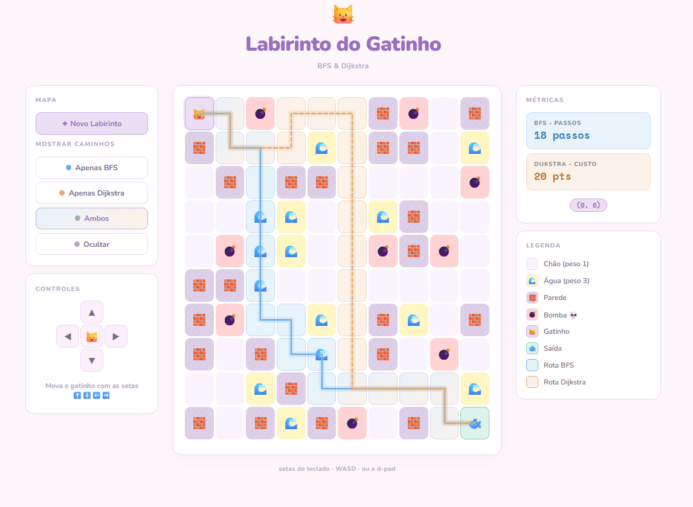
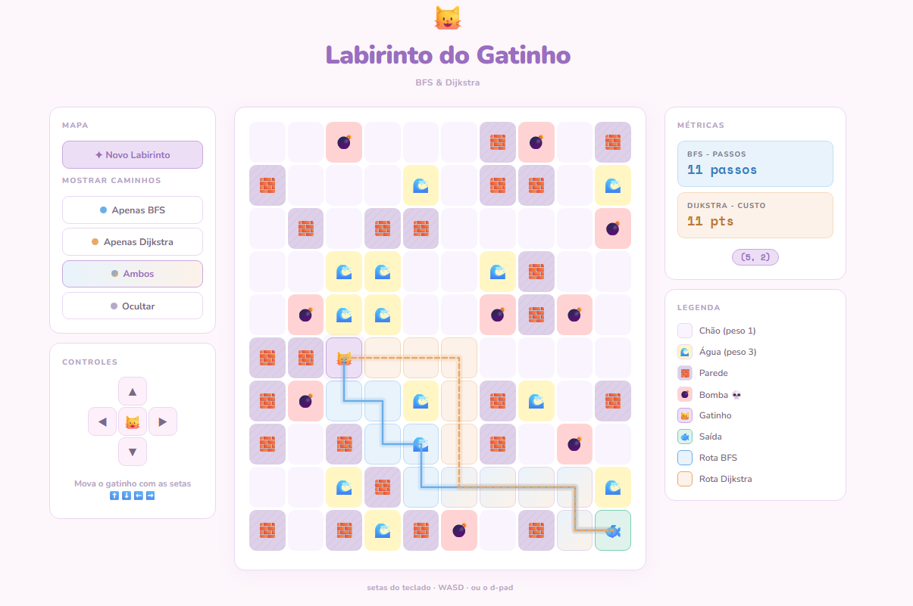
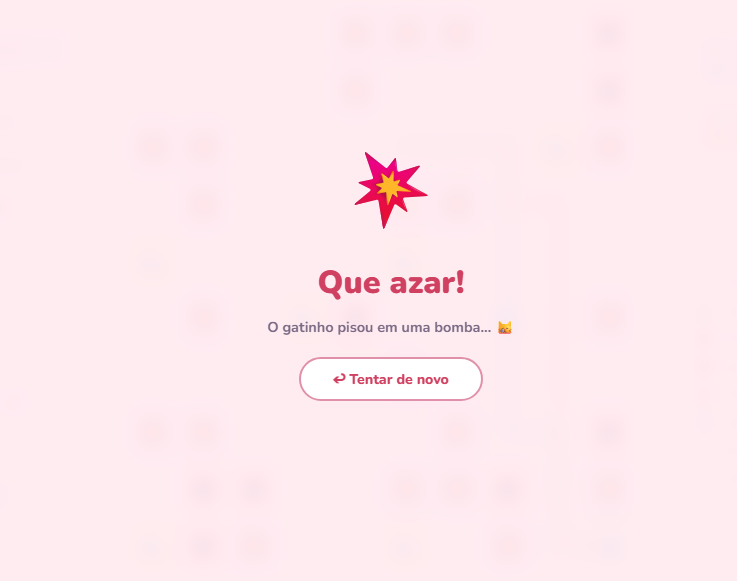

# Labirinto do Gatinho

Número da Lista: 09<br>
Conteúdo da Disciplina: Grafos 1<br>

## Alunos
|Matrícula | Aluno |
| -- | -- |
| 23/1027023  |  Amanda Cruz Lima |
| 22/1031158  |  Felipe de Oliveira Motta |

## Sobre

Projeto desenvolvido como um minijogo de fuga de labirinto. O usuário controla um gatinho 🐱 que deve sair da posição (0,0) e chegar ao peixinho 🐟 em (9,9) em uma grade 10×10 gerada aleatoriamente.

O objetivo central é permitir a visualização e comparação em tempo real de dois algoritmos clássicos de caminho mínimo sobre a mesma estrutura de labirinto:

- **BFS (Busca em Largura):** explora o grafo camada por camada usando uma fila (`deque`). Garante o caminho com o **menor número de passos**, ignorando os pesos das células. Complexidade: O(V + E).
- **Dijkstra:** usa uma fila de prioridade (`heapq`) para processar sempre o nó de menor custo acumulado. Garante o caminho de **menor custo ponderado**, considerando que células de lama têm peso 3 e células livres têm peso 1. Complexidade: O((V + E) log V).

O labirinto é gerado no backend como um grafo representado por **lista de adjacência**. Paredes e bombas não possuem entradas no grafo (intransitáveis). A cada movimento do jogador, os dois algoritmos são executados novamente e os caminhos são desenhados sobre o mapa em tempo real — linha azul contínua para o BFS e linha laranja tracejada para o Dijkstra. Quando os caminhos divergem (por exemplo, quando há lama no trajeto mais curto), é possível observar visualmente a diferença fundamental entre os dois algoritmos.

---

## Screenshots





## Vídeo de Apresentação

<iframe width="560" height="315" src="https://www.youtube.com/embed/gntpDkRv878?si=NZUW2spAqOXfN8RP" title="Grafos01 - Labirinto do Gatinho G09" frameborder="0" allow="accelerometer; autoplay; clipboard-write; encrypted-media; gyroscope; picture-in-picture; web-share" referrerpolicy="strict-origin-when-cross-origin" allowfullscreen></iframe>

[Link Alternativo](https://youtu.be/gntpDkRv878?si=H6GdXlkwSnr1cR_y)

## Instalação

Linguagem: Python 3.10+

**Pré-requisitos:**
- Python 3.10 ou superior instalado

**Comandos:**

```bash
# 1. Entre na pasta do projeto
cd Grafos1_LabirintoDoGatinho

# 2. Crie e ative um ambiente virtual (recomendado)
python -m venv venv

# Linux/macOS:
source venv/bin/activate

# Windows:
venv\Scripts\activate

# 3. Instale a dependência
pip install -r requirements.txt

# 4. Inicie o servidor
python app.py
```

---

## Uso

Após executar `python app.py`, acesse **http://localhost:5000** no navegador.

| Ação | Controle |
|---|---|
| Mover o gatinho | Setas ⬆️⬇️⬅️➡️ ou W / A / S / D |
| Gerar novo labirinto | Botão "Novo Labirinto" |
| Alternar visualização dos caminhos | Botões "Apenas BFS", "Apenas Dijkstra", "Ambos" ou "Ocultar" |

**Objetivo:** levar o gatinho da posição (0,0) até a saída 🐟 em (9,9).

**Tipos de célula:**
- **Chão livre** — transitável
- **Água** 🌊 — transitável
- **Parede** 🧱 — bloqueia o movimento
- **Bomba** 💣 — pisar encerra o jogo imediatamente

O caminho BFS é recalculado a cada passo e atualizados instantaneamente na tela.

---

## Outros

**Estrutura do projeto:**
```
Grafos1_LabirintoDoGatinho/
├── app.py           ← Backend Flask: geração do labirinto, BFS, Dijkstra e API REST
├── requirements.txt ← Dependências (apenas Flask)
└── static/
    └── index.html   ← Frontend completo: HTML, CSS e JavaScript em um único arquivo
```
